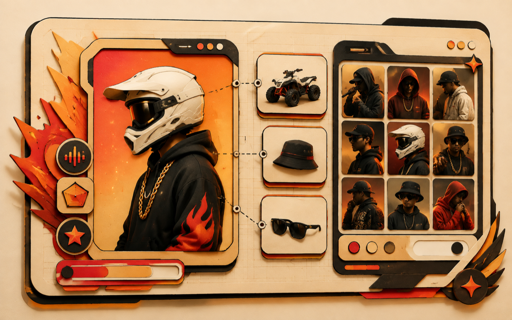

# rap·clips·studio

**Личная студия ИИ-клипов для рэп-треков.** Загружаешь трек — получаешь готовый
вертикальный клип: сквозной сюжет, раскадровка, 4К-кадры каждой сцены и анимация
по первому+последнему кадру, склеенные под твою дорожку.

Дизайн — «солнечная кузница»: светлый футуризм, картонный 2.5D, огненные акценты.

---

## Как это работает

| | |
|---|---|
|  | **Персонажи с модельками.** Имя, характер, фото-модельки и атрибуты (квадрик, панама, самокат…) живут на проект. В промпты кадров подставляются имена и описания, при генерации картинок моделька уходит референсом — герой не «плывёт» между сценами. Персонажей можно клонировать из базы в любой проект. |
|  | **Сюжет и раскадровка.** Claude пишет сквозной сюжет по трекам (или бери свой), затем режет каждый трек на сцены с таймкодами, крупностью планов и движением камеры. Работает и без текста — чисто под бит: идею закладывают комментарий и персонажи. |
|  | **⚡ Супергенерация.** Одна кнопка — весь конвейер: сюжет → раскадровка → первый и последний кадр каждой сцены (4К) → видео каждой сцены → сборка клипа с дорожкой. Живой прогресс на карточке трека, вкладку можно закрыть. |
|  | **Стили только пресетами.** Каждый стиль — полностью срежиссированный промпт: Миядзаки, Синкай, Pixar, нуар, плёночный сюр 90-х, русский кино-сюр и другие. Один стиль на клип — кадры не разъезжаются. |

## Генераторы

- **Картинки** — ChatGPT (шлюз по подписке) с фолбэком на Grok; референсы моделек персонажей.
- **Видео** — Seedance 2.5 через REST API ([seevio.ai](https://seevio.ai)): image-to-video
  по первому+последнему кадру, авто-возврат кредитов при сбоях. Фолбэк — Grok Imagine.
- **Тексты** — Claude (шлюз по подписке).

## Стек

FastAPI + SQLAlchemy (SQLite) · vanilla JS SPA · ffmpeg (нарезка аудио, апскейл
кадров, сборка клипа) · Docker. Схема БД мигрирует мягкими `ALTER` при старте —
данные переживают любой деплой.

## Запуск

```bash
cp infra/.env.example infra/.env   # APP_PASSWORD, SECRET_KEY, SEEVIO_API_KEY
cd infra && docker compose up -d --build
```

Приложение поднимется на `127.0.0.1:8930` (за реверс-прокси). Шлюзы генерации —
отдельные сервисы на хосте (см. `infra/`).

---

*Личный проект. Публикуется как есть — без поддержки и гарантий.*
